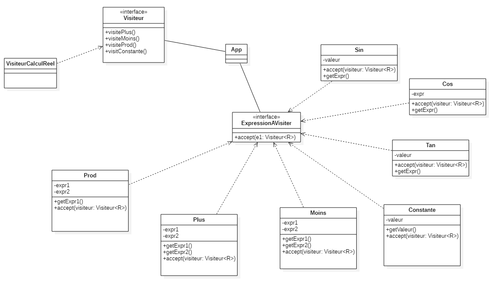
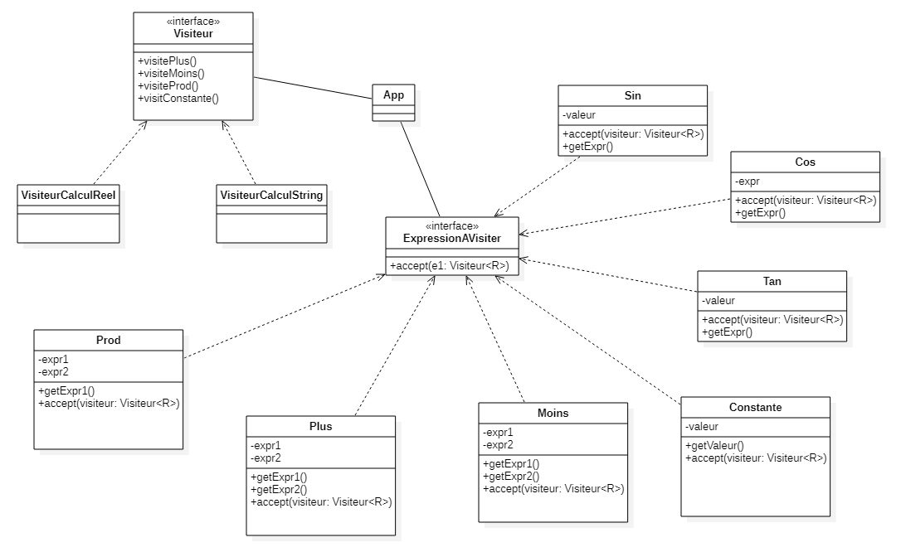

# Version case of (avec elm)
L évaluation d une expression arithmetique est recursive, Plus Moins et Fois operent sur des Expressions.   

Par exemple "2 + (3*4)" est une expression composée elle même de deux expressions:
-   2 
-   3*4

## Définition d'une expression
``` elm
type Expr = Plus     Expr Expr
            | Moins  Expr Expr
            | Fois   Expr Expr 
            | Const  Float

```


L'exemple précédent s'écrit : Plus( (Const 2) , Fois ( Const(3) , Const (4))) 


## Fonction d'évaluation
``` elm
eval : Expr ->  Float
eval  o =
    case o of 
        Plus  x y ->  (eval x ) + (eval  y)
        Moins x y ->  (eval x ) - (eval  y)
        Fois x y  -> (eval x ) * (eval  y)
        Const x -> x
```
Déroulement de l'évaluation :   
- eval ( Plus (Const 2)  (Fois (Const 3)(Const 4)))
- Ici X = Const 2, et Y = Fois (Const 3)(Const 4)), Donc :   
- eval ( Plus (Const 2)  (Fois (Const 3)(Const 4))) -> (eval (Const 2)) + (eval(Fois (Const 3)(Const 4)))
- On peut remplacer eval(Const 2) par 2, on obtient :   
- 2 + (eval(Fois (Const 3)(Const 4)))
Ici X = (Const 3) et Y = (Const 4) Donc :   
- 2 + (eval (Const 3)) * (eval(Const 4))
- On peut remplacer eval(Const 3) par 3 et eval(Const 4) par 4 on obtient :   2 + (3*4) = 2 + 12 = 14   

# Version visitor (avec Java)

## Interface Visiteur
``` java
public interface Visiteur<R>{
        public R visitConstante(Constante constante);
        public R visitProd(Prod prod);
        public R visitMoins(Moins moins);
        public R visitPlus(Plus plus);       
        public R visitPuissance(Puissance puissance);
}
```
## Interface ExpressionAVisiter
Elle a une seule méthode : accept . Laquelle prend en entrée un visiteur de type R et retourne une valeur de type R.
``` java
public interface ExpressionAVisiterr {
    public  <R> R accept(Visiteur<R> e1);
}
```

## Définition des opérateurs
### Plus
``` java
public class Plus implements Expr{

    private Expr expr1;
    private Expr expr2;
    
    public Plus(Expr expr1 , Expr expr2){
        this.expr1 = expr1;
        this.expr2 = expr2;
    }

    public <R> R accept (Visiteur<R> visiteur ){
        return visiteur.visitPlus(this);
    }
 //à définir : getExpr1();getExpr2()
}
``` 

Les  opérateurs Prod et Moins sont construits de la même manière, c'est la méthode accept qui change.
## Moins
``` java
public <R> R accept (Visiteur<R> visiteur ){
        return visiteur.visitMoins(this);
    }
``` 

## Prod
``` java
public <R> R accept (Visiteur<R> visiteur ){
        return visiteur.visitProd(this);
    }
``` 

Le cas de Constante est un peu différent puisqu'il son opérande n'est pas une expression mais une valeur numérique

## Constante
```java
public class Constante implements Expr{
    private double valeur;
    
    public Constante (double valeur){
        this.valeur = valeur;
    }
    public <R> R accept (Visiteur<R> visiteur ){
        return visiteur.visitConstante(this);
    }
 //à définir : getValeur();
}
```
 

## Classe VisiteurCalculReel
```java
public class VisiteurCalculReel implements Visiteur<Double> {

    public Double  visitConstante(Constante constante){
        return constante.getValeur();
    }

    public Double visitProd(Prod prod){
        Double evalExpr1 =  prod.getExpr1().accept(this);
        Double evalExpr2 =  prod.getExpr2().accept(this);
        return evalExpr1 * evalExpr2;
    }
    public Double visitMoins(Moins moins){
        Double evalExpr1 =  moins.getExpr1().accept(this);
        Double evalExpr2 =  moins.getExpr2().accept(this);
        return evalExpr1 - evalExpr2;
    }
    public Double visitPlus(Plus plus){
        Double evalExpr1 =  plus.getExpr1().accept(this);
        Double evalExpr2 =  plus.getExpr2().accept(this);
        return evalExpr1 + evalExpr2;
    }
    public Double visitPuissance(Puissance puissance){
        Double evalExpr1 =  puissance.getExpr1().accept(this);
        double n =  puissance.getN();
        return Math.pow(evalExpr1 , n);
    }
}

```
On viste l'expression : new Plus (new Constante(2) , new Produit(new Constante(3) , new Constante(4)))   
On obtient successivement :   
-   (new Constante(2)) + (new Produit(new Constante(3) , new Constante(4)))
-    2 + ((new Constante(3) * new Constante(4)))
-   2  + ( 3 * 4)
-   14

# Et si ?
## Et si on voulait ajouter un opérateur?


Par exemple comment ajouter les opérateurs cosinus, sinus et tangeante?   
Dans les deux cas il faut :
-   les ajouter au type expression
-   définir leur calcul   

Donc en elm :
``` elm
type Expr = Plus     Expr Expr
            | Moins  Expr Expr
            | Fois   Expr Expr 
            | Const  Float

```
devient   

``` elm
type Expr = Plus     Expr Expr
            | Moins  Expr Expr
            | Fois   Expr Expr 
            | Const  Expr 
            | Cos    Expr 
            | Sin    Expr 
            | Tan    Expr 
```
et trois cas doivent être ajoutés à éval   
-   Cos x ->    cos(eval x )
-   Sin x ->    sin(eval x )
-   Tan x ->    tan(eval x )

En java c'est exactement le même principe.   
On ajoute trois nouvelles méthodes à l'interface Visiteur   
``` java
public interface Visiteur<R>{
        //.....  
        public R visitCos(Cosinus cosinus);
        public R visitSin(Sinus sinus);
        public R visitTan(Tan tan);
}
```
Avec les trois classes correspondantes   
``` java
public class Cosinus implements Expr{
    private Expr expr1;
    public Cosinus(Expr expr1){
        this.expr1 = expr1;
    }
    public <R> R accept (Visiteur<R> visiteur ){
        return visiteur.visitCos(this);
    }
 //à définir : getExpr1();
}
``` 
Sinus et Tan sont similaires, seule la fonction accept est modifiée :   
``` java
    public <R> R accept (Visiteur<R> visiteur ){
        return visiteur.visitSin(this);
    }
    public <R> R accept (Visiteur<R> visiteur ){
        return visiteur.visitTan(this);
    }
``` 
Il faut maintenant indiquer comment ces expressions sont évaluées   
Dans calcul : 
   ``` java
   public Double visitCos(Cosinus cosinus){
                Double evalExpr1 =  cosinus.getExpr1().accept(this);
                return Math.cos(evalExpr1);
            }
    public Double visitSin(Sinus sinus){
                Double evalExpr1 =  sinus.getExpr1().accept(this);
                return Math.sin(evalExpr1);
            }
    public Double visitTan(Tan tan){
                Double evalExpr1 =  tan.getExpr1().accept(this);
                return Math.tan(evalExpr1);
            }
 ```
## Et si on voulait changer la méthode de calcul?


On pourrait vouloir visiter la même expression mais changer l'implémentation du visiteur.
Par exemple 
-   Plus(d1,d2)     =   "(d1 + d2)"
-   Moins(d1,d2)    =   "(d1 - d2)"
-   Prod(d1,d2)     =   "(d1 * d2)"

Pour cela il faut ajouter une nouvelle classe : VisiteurOperationString, laquelle implémentera Visiteur.   
Il faut uniquement définir les méthodes de l'interface Visiteur : 
```java
public class VisiteurCalculString  implements Visiteur<String> {
  public String  visitConstante(Constante constante){
        return String.valueOf(constante.getValeur());
    }

    public String visitProd(Prod prod){
        String evalExpr1 =  prod.getExpr1().accept(this);
        String evalExpr2 =  prod.getExpr2().accept(this);
        return "(" +  evalExpr1 + "*" + evalExpr2 +")";
    }
    public String visitMoins(Moins moins){
        String evalExpr1 =  moins.getExpr1().accept(this);
        String evalExpr2 =  moins.getExpr2().accept(this);
        return "(" +  evalExpr1 + "-" + evalExpr2 +")";
    }
    public String visitPlus(Plus plus){
        String evalExpr1 =  plus.getExpr1().accept(this);
        String evalExpr2 =  plus.getExpr2().accept(this);
        return "(" +  evalExpr1 + "+" + evalExpr2 +")";
    }
    public String visitPuissance(Puissance puissance){
        String evalExpr1 =  puissance.getExpr1().accept(this);
        double n =  puissance.getN();
        return "(" +  evalExpr1 + "^" + n +")";
    }
}
```