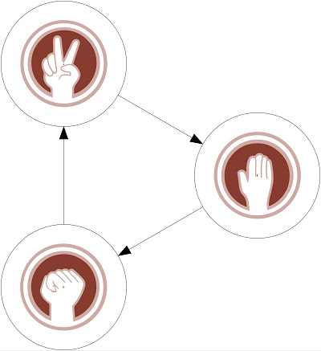

### Graphes 
Un graphe est une représentation d'un modèle composé de sommets (appelés **noeuds**)et d'arêtes (appelés **lien**) reliant certains de ces sommets.

### Exemple 1 
Représentation des conditions de victoire du jeu pierre feuille ciseaux



## Mise en place
Qu'il s'agisse de simulation de lancers de pièce ou des règles d'un jeu le principe est le même : **Créer chaque noeuds** et **établir les liens** qui existent entre eux.   
Ce qui peut se faire ainsi dans l'exemple du jeu : 
```
creerGraph  ::  Gr L.Text L.Text
creerGraph  = mkGraph
[(0,pack "Pierre") , (1,pack "Ciseaux")  , (2,pack "Feuille")]
[(0,1,pack "Casse"), (1,2,pack"Coupent") , (2,3,pack"Enveloppe")]
```

Reprenons le jeu précédent mais enrichissons le de deux nouveaux choix : Lezard et Spock   


```
creerGraph :: Gr L.Text L.Text
creerGraph
= mkGraph
(
    [(0,pack "Pierre"),
    (1,pack"Ciseaux"),
    (2,pack"Feuille"),
    (3,pack "Lezard"),
    (4, "Spock")
    ]
)
(
    [(0,1,pack"Casse"),
    (1,2,pack"Coupent"),
    (2,0,pack"Enveloppe"),
    (3,4,pack"Empoisonne"),
    (4,1,pack"Ecrabouille"),
    (1,3,pack"Decapite"),
    (3,2,pack"Mange"),
    (2,4,pack"Repousse"),
    (4,0,pack"Detruit"),
    (2,3,pack"Ecrase")
])
```


## Inconvenients et solutions
### Le code est répétitif, on peut le factoriser

```
creaGr ::  Gr L.Text L.Text
creaGr  = 
  let
    listTaill   =   [0.. ((List.length listChoix) - 1 )]
    affChoix    =   List.map(\elt -> pack(show elt)) listChoix 
    zipl        =   List.zip ListTaill affChoix
    fl          =   List.map
                        (\(x,y,z) -> (x,y,pack (show z))) associe2 in mkGraph zipl fl
```

### Il y a 5 noeuds et 10 relations, utiliser des types plutôt que des chaînes de caractères. 

``` 
data Choix = Pierre 
            |Feuille
            |Ciseaux|Lezard
            |Spock  deriving (Show)

data PointFort  = Casse 
  |Coupent 
  |Enveloppe  
  |Repousse 
  |Ecrabouille 
  |Ecrase 
  |Empoisonne  
  |Detruit  
  |Mange 
  |Decapitent deriving(Show)
```

### Définir les relations entre les noeuds
```
associe ::  [(Int,Int, PointFort)]
associe = 

List.map(\(a,b,elt) -> (numero a, numero b, elt))[
  (Ciseaux, Feuille, Coupent),
  (Feuille, Pierre,  Enveloppe),
  (Pierre,  Ciseaux, Casse),
  (Lezard,  Spock,   Empoisonne),
  (Spock,   Ciseaux, Ecrabouille),
  (Ciseaux, Lezard,  Decapitent),
  (Lezard,  Feuille, Mange),
  (Feuille, Spock,   Repousse),
  (Spock,   Pierre , Detruit),
  (Pierre,  Lezard,  Ecrase)]
``` 
(Lien vers le code complet)[https://github.com/ljuglaret/Graphes/blob/gh-pages/gr.hs]


